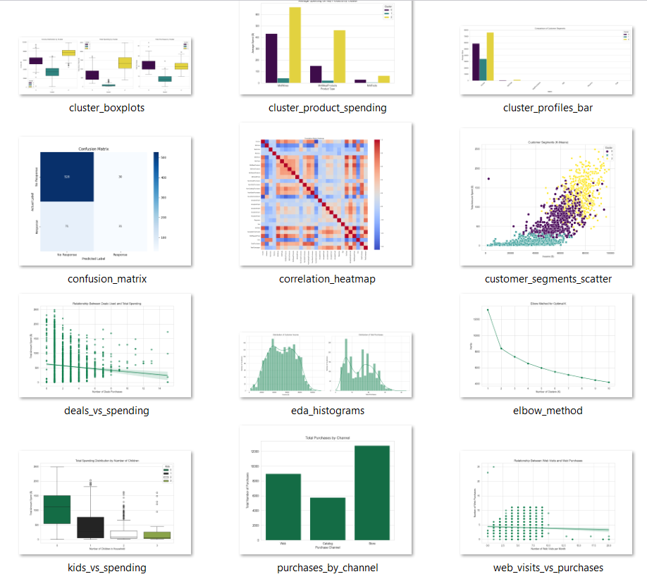

### Customer Analytics: A Data-Driven Marketing Strategy

---

### 1. Project Overview

This project provides a comprehensive analysis of customer data to inform and optimize marketing strategy. By leveraging the power of data science, we move beyond a 'one-size-fits-all' approach to create a data-driven framework for customer engagement. The final deliverable includes actionable insights, customer segmentation, and a predictive model to maximize marketing ROI.

### 2. Project Objectives

-   **Data Exploration (EDA):** Analyze customer demographics, spending habits, and campaign responses to uncover key behavioral patterns.
-   **Customer Segmentation:** Group customers into distinct, actionable segments based on their purchasing behavior using clustering techniques.
-   **Predictive Modeling:** Build a predictive model to identify customers who are most likely to respond to future marketing campaigns.
-   **Strategic Recommendations:** Translate data insights into clear, actionable business recommendations for marketing, sales, and product teams.

## 📊 Demo 

### 3. Methodology

The analysis follows a standard data science pipeline:

-   **Data Exploration & Cleaning:** Performed initial data cleaning, outlier detection, and feature engineering to prepare the dataset for analysis.
-   **Exploratory Data Analysis (EDA):** Utilized various visualizations to understand income distribution, spending patterns, and the correlation between demographic features and purchases.
-   **Unsupervised Learning:** Applied **K-Means Clustering** to segment the customer base into three distinct groups.
-   **Predictive Modeling:** Built and evaluated a **Logistic Regression** model to predict campaign response, focusing on key business metrics like Recall and Accuracy.
-   **Business Storytelling:** Consolidated all findings into a final presentation with clear, data-driven recommendations.

### 4. Key Findings & Insights

-   **Spending vs. Demographics:** Customer spending is strongly correlated with income and is significantly higher in households with no children.
-   **Customer Segments:** We identified three key customer segments: **High-Value, High-Spender**; **Mid-Tier Family Shopper**; and **Low-Spender, Low-Engager**.
-   **Campaign Effectiveness:** The predictive model achieved a **Recall of 78%**, indicating a high success rate in identifying customers who will respond to campaigns.

### 5. Repository Contents

This repository is structured to be easily navigable, with all project files and outputs organized in dedicated folders.

-   **`notebooks/`**: Contains the Jupyter Notebook files documenting the complete analysis from EDA to predictive modeling.
-   **`data/`**: Holds the `ifood_df_updated.csv` dataset used for the project.
-   **`reports/`**: Stores all the graphs, plots, and visualizations generated during the analysis.

### 6. Skills & Technologies

-   **Languages:** Python
-   **Libraries:** Pandas, NumPy, Matplotlib, Seaborn, Scikit-learn
-   **Concepts:** Data Exploration, Data Cleaning, Outlier Detection, Feature Engineering, K-Means Clustering, Logistic Regression, Model Evaluation, Data Visualization, Business Storytelling

---
## 📬 Contact  
- Email: 26kirangosavi@gmail.com
- LinkedIn: [Kiran Gosavi](https://www.linkedin.com/in/kirangosavi/)

---
